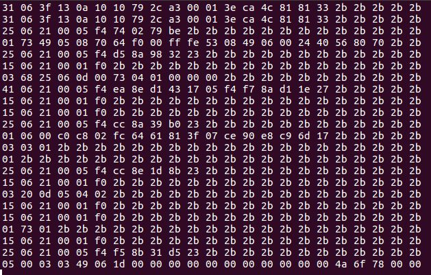
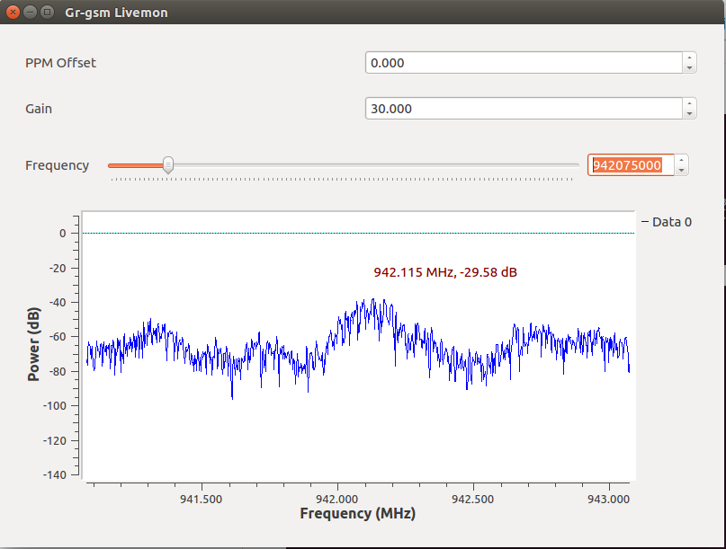
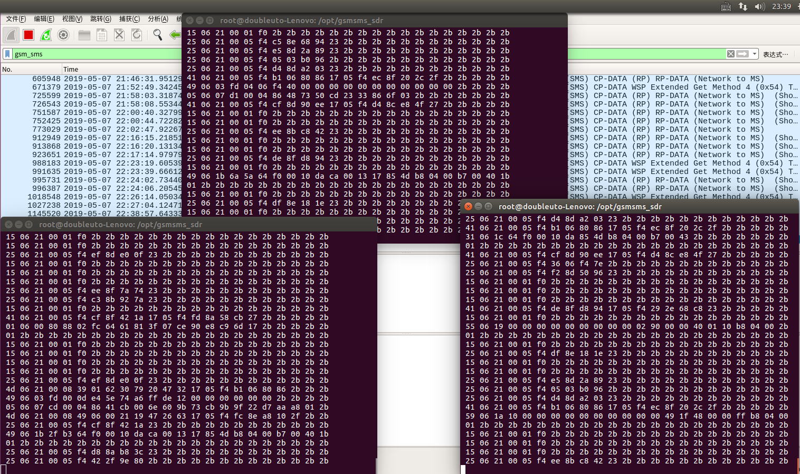

# gsmsms_sdr
根据 https://github.com/le4f/gsmsniff 修改而来的

使用sdr嗅探gsm短信，GSM在中国是没有加密的。


# 硬件
- USB DVB-T key（RTL2832U）
- 一台笔记本

## 环境
- ubuntu 16.04

## 文件列表
- sms_forward.py: 转发sdr来的数据。
- gsmsms_sniff.py:解码和显示短信内容。
- gsmsms_sniff_mysql.py:解码和显示短信内容,并存入sql数据库。
- sms.sql

## 安装依赖
- apt-get install git cmake libboost-all-dev libcppunit-dev swig doxygen liblog4cpp5-dev python-scipy python-scapy
- apt-get install python-mysqldb
- apt-get install gnuradio gnuradio-dev rtl-sdr librtlsdr-dev osmo-sdr libosmosdr-dev libosmocore libosmocore-dev cmake libboost-all-dev libcppunit-dev swig doxygen liblog4cpp5-dev python-scipy python-scapy

## gr-gsm
```
git clone https://github.com/ptrkrysik/gr-gsm.git
cd gr-gsm
mkdir build
cd build
cmake ..
make
sudo make install
sudo ldconfig 
```

## docker
https://github.com/marcelmaatkamp/docker-gnuradio-gr-gsm-ptrkrysik

# 选择一个设备，看你用的是什么设备(hackrf还是rtl-sdr)
## kalibrate-hackrf
```
git clone https://github.com/scateu/kalibrate-hackrf.git
cd kalibrate-hackrf
./bootstrap
./configure
make
sudo make install
```

## kalibrate-rtl(kalibrate For rtl-sdr)
```
git clone https://github.com/steve-m/kalibrate-rtl.git
cd kalibrate-rtl
./bootstrap
./configure
make
sudo make install
```


## 使用方法

kal -s GSM900
```
Found 1 device(s):
  0:  Generic RTL2832U OEM

Using device 0: Generic RTL2832U OEM
Found Rafael Micro R820T tuner
Exact sample rate is: 270833.002142 Hz
[R82XX] PLL not locked!
kal: Scanning for GSM-900 base stations.
GSM-900:
	chan: 14 (937.8MHz + 36.967kHz)	power: 33228.76
	chan: 17 (938.4MHz + 37.421kHz)	power: 31349.29
	chan: 19 (938.8MHz + 37.551kHz)	power: 50485.25
	chan: 24 (939.8MHz + 37.361kHz)	power: 50187.10
	chan: 30 (941.0MHz + 36.515kHz)	power: 145977.48
	chan: 34 (941.8MHz + 36.540kHz)	power: 37868.97
```

grgsm_livemon -f 937.4M
在Gr-gsm livemon能采集到数据的情况下。





打开一个终端启动python sms_forward.py,然后在开一个终端运行python gsmsms_sniff.py。


## 关于上行与下行
- 上行：手机发给基站
- 下载：基站转发给手机
```
PS:据说850--900是上行信息，900-999是下行信息，
可以使用kal -s GSM850查找上行，kal -s GSM900查找下行
grgsm_livemon_headless:这个是命令行的。
```

## 多个设备
```
1、用gqrx查找到Device string
2、grgsm_livemon_handless --args=rtl=0
3、grgsm_livemon -f 939.534M --args=rtl=1 --serverport=4730 --collectorport=4730 --collector=127.0.0.1
   --args,代表选择使用哪个设备
   --serverport 和 --collectorport 必须一致，要不然收不到数据
   -- 端口在4729-6000内都可以使用
```
## 贴一张我同时跑3个设备的图片


